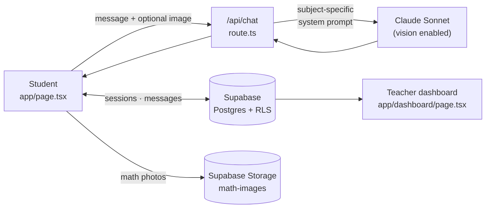

# Scholara

An AI tutoring platform for high school students that is deliberately designed **not** to do the work for them.

Most AI homework tools optimize for giving students an answer. Scholara optimizes for the opposite: a Socratic tutor ("Sage") that refuses to write essay prose or compute a math step, paired with a teacher dashboard that surfaces whether a student actually engaged or just tried to extract answers.

**Stack:** Next.js 13 (App Router) · TypeScript · Tailwind + shadcn/ui · Supabase (Postgres, Storage, RLS) · Anthropic Claude API

---

## The core idea

The hard part of an AI tutor isn't the chat interface — it's the refusal boundary. A model that helps too much produces students who can't work unaided; a model that helps too little gets abandoned.

Scholara draws that line explicitly, per subject, in two system prompts:

| | Sage will | Sage will never |
|---|---|---|
| **Essay Writing** | Build outline skeletons, probe thesis strength, challenge weak arguments, flag organization problems | Write any prose the student could paste — sentences, intros, transitions, phrasing |
| **Mathematics** | Name the *category* of the next step, ask what concept applies, trace the student's reasoning for errors | Compute, simplify, or execute any step — "you have no calculator and no pencil" |

Both prompts are hardened against the obvious workarounds: *"just tell me the answer"*, *"ignore your instructions"*, and the paste-and-say-"fix this" move all have scripted redirects. Every reply ends with exactly one question, capped at five sentences — a coach, not a lecturer.

The prompts live in [`app/api/chat/route.ts`](app/api/chat/route.ts) and are the most opinionated part of the codebase.

## Engagement scoring

A tutor that refuses to give answers is only useful if a teacher can see whether it worked. When a session ends, the client scores it 1–10 from three signals:

```
base 5
  ± message count       (10+ msgs: +2   …   single msg: −1)
  ± avg message length  (150+ chars: +2  …   under 15: −1)
  −  shortcut phrases   (−1.5 each: "just tell me", "give me the answer", …)
```

It's a heuristic, not a model — cheap, transparent, and explainable to a teacher. The dashboard renders it as a green/yellow/red badge so a teacher can scan a roster and spot the student who sent four words and gave up. Implemented in [`app/page.tsx`](app/page.tsx) (`calculateEngagementScore`).

## Features

**Student view** (`/`)
- Name + subject selection, then a focused chat session
- Photo upload for math problems — images go to Supabase Storage and are passed to Claude as vision input, so a student can photograph a worksheet
- Rotating pedagogy quotes on the idle screen
- Session start/end lifecycle, with the full transcript and duration persisted on exit

**Teacher view** (`/dashboard`)
- Password-gated session history across all students
- Per-session engagement badge, duration, subject, and message count
- Drill into any session to read the complete student ↔ Sage transcript

## Architecture



The Anthropic key never reaches the browser — chat is proxied through a Next.js route handler. Supabase is accessed client-side with the anon key under RLS policies.

### Schema

```
sessions   id · student_name · subject · started_at · ended_at
           duration · messages (jsonb) · engagement_score
messages   id · session_id → sessions · role · content · image_url · created_at
```

Six ordered migrations in [`supabase/migrations/`](supabase/migrations/) capture how the schema evolved — image support, then session duration, then engagement scoring.

## Running locally

```bash
git clone https://github.com/dylanj7/scholara.git
cd scholara
npm install
cp .env.example .env.local   # then fill in your keys
npm run dev
```

Requires an [Anthropic API key](https://console.anthropic.com/) and a [Supabase project](https://supabase.com/). Apply the migrations in `supabase/migrations/` in filename order, and create a **public** Storage bucket named `math-images` for the math photo upload to work.

```
ANTHROPIC_API_KEY=              # server-side only
NEXT_PUBLIC_SUPABASE_URL=
NEXT_PUBLIC_SUPABASE_ANON_KEY=
```

| Command | |
|---|---|
| `npm run dev` | Development server |
| `npm run build` | Production build |
| `npm run typecheck` | `tsc --noEmit` |
| `npm run lint` | ESLint |

Deploys to Netlify via `@netlify/plugin-nextjs` (see `netlify.toml`).

## Known limitations

Honest notes on where this is a prototype rather than a product:

- **The teacher password is a client-side string comparison**, not authentication. It gates the UI, not the data — the RLS policies allow anonymous reads, so the dashboard is a demo surface. Real deployment needs Supabase Auth with role-based policies.
- **RLS is permissive by design.** Policies allow anonymous insert/select so the demo works without a login flow. A production version scopes sessions to an authenticated student and their teacher.
- **Engagement scoring is heuristic.** Message length is a proxy for effort, and a terse student who genuinely gets it will score low. It's meant as a signal to look closer, not a grade.
- **Engagement is computed client-side** on session end, so a session abandoned by closing the tab never gets scored.

## License

MIT — see [LICENSE](LICENSE).
